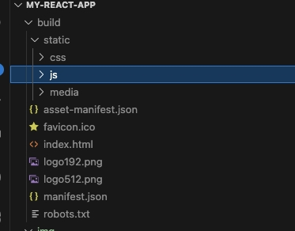
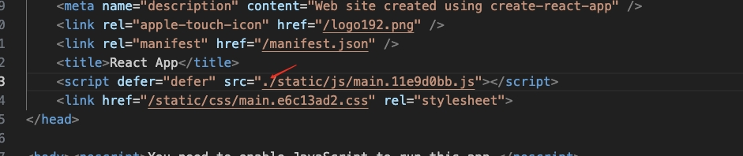

# Getting Started with Create React App

This project was bootstrapped with [Create React App](https://github.com/facebook/create-react-app).

React demo, 引入一个 js 库 debeem-id, 用于验证移动端通过 WebView 调用 js 方法.

# 使用 

1. 执行 `yarn web` 命令打包, 成功后会在根目录生成 build 文件夹

   

2. 对 `build/index.js` 进行修改(修改相对路径以正常加载 Web)

   

3. 可以通过浏览器打开 `build/index.js` 验证 Web 正确性